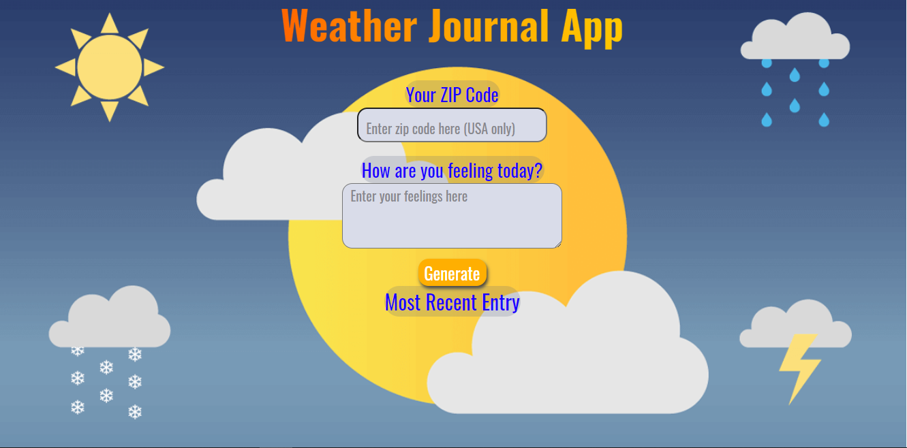

# Weather-Journal App Project

### Overview

Created an asynchronous web app that uses Web API and user data to dynamically update the UI.

### Instructions

- Make sure node is installed by running `node -v` in your terminal.
- Install the needed packages by `npm install express body-parser cors`
- To start the server, type `node server.js` in your terminal.

### Description

-Set up project environment. Installed the packages Express, Body-Parser, and Cors from the terminal and then included them in server.js file.

-Created a server running on the port 8000 and added a console.log() to the server callback function, to test that the server is running.

-In the server.js file, added a GET route that returns the projectData object and a POST route that adds incoming data to projectData.

-Acquired API credentials from OpenWeatherMap website to use to create global variables at in the app.js code.

-Wrote an async function in app.js that uses fetch() to make a GET request to the OpenWeatherMap API.

-Wrote another async function to make the POST request to add the API data.

-Wrote another async function that is called after the completed POST request. This function will retrieve data from the app, select the necessary elements in the index.html file, and then update their necessary values to reflect the dynamic values for: - Temperature - Date - Content (user response)

-Created an event listener for the button, with a callback function to execute when it is clicked:
-After the retrieval of the weather data, chained another Promise that makes a POST request to add the API data, as well as data entered by the user, to your app.
-Chain another Promise that updates the UI dynamically.

### Demo

### Credits:

https://w3bits.com/rainbow-text/
